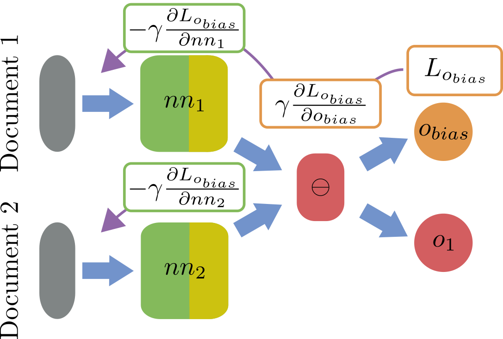

# Fair Pairwise Learning to Rank

 

Mattia Cerrato</img>, Marius Köppel </img>, Alexander Segner </img>,

Roberto Esposito</img>, Stefan Kramer </img>

  

</img> : Università degli Studi di Torino, Torino, Italy
</img> : Johannes Gutenberg-Universität, Mainz, Germany

--- 

<!-- paginate: true -->
<!-- footer: Cerrato, Fair Pairwise Learning to Rank. DSAA 2020.
-->

# The Fairness Problem

**Neural Network models** are being increasingly employed in learning to rank tasks

These models are inherently **opaque**, as their huge parameter space prevents a clear understanding of their decisions

When dealing with sensitive data such as race and gender, there is no guarantee about their **fairness**

---

# The Fairness Problem

If the data contains **biases** against a specific group of people, those can also be learned by a ML model

* **Disparate impact**: positive outcomes are assigned with different rates to people belonging to different groups
* **Disparate treatment**: the model takes different decisions for individual belonging to different groups *who are otherwise similar*
* **Disparate mistreatment**: a decision system has different error rates for different groups

---

# The Fairness Problem in Ranking

$$ D = \{(q_i, x_i, s_i, y_i) \; i \in \{1 .. N\}\} $$

$q_i$ : queries
$x_i$: features
$y_i$: document relevance
$s_i$: sensitive attribute

---

# The Fairness Problem in Ranking

* Singh and Joachims, 2018: **average exposure** of groups should be balanced, i.e. the average probability of individuals from each group to be ranked at the top of the list
* Yang, Stoyanovich, 2017: the proportion of people belonging to different groups should be balanced at the top-$i$ positions
* Narashiman et al., 2020: difference in rank accuracy should be balanced between different groups

---

## Normalized Discounted Difference (rND)

$$\text{rND} = \frac{1}{Z} \sum_{i \in \{10, 20, ...\}}^N \frac{1}{log_{2}i} \mid \frac{ \mid S^{+}_{1...i} \mid}{i} - \frac{\mid S^+ \mid}{N} \mid $$

$\frac{ \mid S^{+}_{1...i} \mid}{i}$: proportion of protected individuals in the top-$i$ documents
$\frac{\mid S^+ \mid}{N}$: proportion of protected individuals in the overall population/query

**Values close to 0** are desirable.

---

## Group-Dependendent Pairwise Accuracy (GPA)

$G_1, ..., G_K$: a set of K groups
$A_{G_i > G_j}$: group-dependent pairwise accuracy - i.e. ranker accuracy on documents which are labelled more relevant and belong to group $i$; and ranker accuracy on documents which are labelled less relevant and belong to group $j$.

$|A_{G_i > G_j} - A_{G_j > G_i}|$ **should be close to 0**.

---

## The Fair DirectRanker Framework

We build on a fast, *pairwise* ranking model (DirectRanker, Köppel et al. 2019) by employing different strategies to encourage fair outputs.

* The Gradient Reversal Layer of Ganin et al., 2016
* The Noise Module by Cerrato et al., 2020

We introduce a family of neural architectures that are able to **rank without discriminating**.

---

## The Fair DirectRanker Framework

  

$$
\begin{aligned}
L(\Delta y,x_1,x_2,s_1,s_2) &= L_{\text{rank}}(\Delta y,x_1,x_2) \\ &+\gamma\sum_{i=1}^2L_{\text{bias},i}(s_i,x_i),
\end{aligned}
$$

---

## Fair Adversarial DirectRanker

---

## Fair Adversarial DirectRanker

* Two **debiasing networks** try to predict the sensitive attribute/group the individual belongs to
* The gradient is *inverted* when backpropagating into the main network (Ganin et al. 2016)

---

## Fair Adversarial DirectRanker
 
 

$$L_{\text{rank}}(\Delta y,x_1,x_2)=(\Delta y-o_1(x_1,x_2))^2$$
 

$$\begin{aligned}
L_{\text{bias},i}(s,x)&=-s\log(nn_{i\,bias}(x)) \\ &-(1-s)\log(1-nn_{i\,bias}(x)),
\end{aligned}$$

---

## Fair Flipped DirectRanker

---

## Fair Flipped DirectRanker

* The features extracted from the main network are **ranked** according to the sensitive attribute
* The gradient information is again **flipped** when backpropagating into the main network

---

## Fair Flipped DirectRanker

  

$$
\begin{aligned}
L(\Delta y,\Delta s,x_1,x_2)&=L_{\text{rank}}(\Delta y,x_1,x_2)\\&+\gamma L_{o_{bias}}(\Delta s,x_1,x_2)   
\end{aligned}$$

---

space for experimental results and discussion...

---

